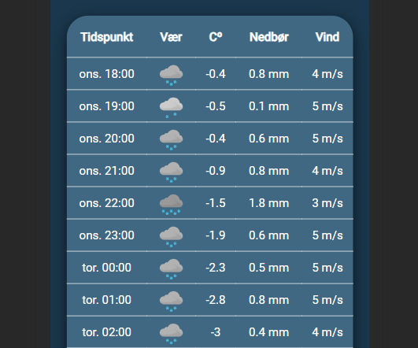

# Peak Conditions

## Kjøring av appen

For å kjøre appen lokalt så må man ha node 20.6.0 og nvm 9.8.0. Deretter skriv følgende fra rotmappen til prosjektet:

```terminal
npm install
npm run dev
``` 

## Kjøring av ESLint og Prettier

For å kjøre ESLint må man kjøre følgende kommando:

```terminal
npm run lint
``` 

For å kjøre Prettier må man kjøre følgende kommando:

```terminal
npm run prettier
``` 

## Kjøring av tester

For å kjøre testene må man kjøre følgende kommando:

```terminal
npm run prettier
``` 

## Beskrivelse av appen

Peak Conditions skal gi brukere en bedre måte sjekke været hos skisteder. Når man først går inn på siden så ser man destinasjoner og været på det laveste punktet til skistedet. Når man trykker på en destinasjon så får man opp været time for time for det laveste punktet. Man kan velge om man vil se været for et punkt på bunn av et skisted, midten eller toppen ved å trykke på en av knappene som er fiksert til midten av skjermen.  

## Funksjonalitet

Vi har antatt at man kan presentere ett og ett kort i en grid (en form for liste) der scorlling er muligheten til å bla seg frem eller tilbake. Man hopper til en spesifikk ressurs ved å trykke på kortet.

Siden har også sortering og filtrering. Det er mulig å sortere skistedene alfabetisk. Det er mulig å filtere bort skisteder som ikke er favoritter. Skisteder som er lagret som favoritter huskes hvis du lukker igjen nettleseren din og åpner den igjen. Hvis du refresher siden vil den huske om du filtrerer alfabetisk eller reversert alfabetisk og om du har valgt å bare vise favoritter.

Man kan trykke på stjernen i et destinasjonskort for å legge den til som favoritt. Dette valget huskes hvis du starer nettleseren på nytt.

Siden er responsiv som gjør at appen kan brukes på store skjermer og mindre smarttelefoner.

Et godt eksempel av ryddig utforming er kortene på startsiden. Hvis man er på mobil så endres presentasjonen av kortene fra tre kort per rad til ett. 

Appen vil aldri sende flere requests til meteorologisk institutts API enn nødvendig. Appen sjekker når meteorologisk institutt skal oppdatere værvarslingen for et skisted og holder dataen fersk helt frem til da.

## Hva som er testet

Det er komponent tester for NavBar, DestinationCard og NewForecastList. Dekningsgraden på komponentene er høy, og API kall blir avbrutt av Mock Service Worker. NavBar og NewForecastList har i tillegg en snapshot test.

## Endringer fra første til andre vurdering

- Fikset bug som gjorde at siden ikke hadde riktig font.
- Fjernet weatherNowComponent fra DestinationPage (og prosjektet).
- Endret værmelding til å være time for time istedenfor dag for dag (ved hjelp av ny komponent og sletting av den gamle) 
- La til knapper som lar brukeren velge hvilket punkt man ser på. Disse knappene erstatter WeatherNowComponent
- La til favicon
- La til page title som er dynamisk
- Endret navbar til å være position fixed fra position absolute
- Endret på filstrukturen til prosjektets sånn at filer som hører sammen er gruppert
- Endret på ESLint config til airbnb, airbnb typescript og prettier (altså config som fjerner formattering fra ESLint)
- Endret på Filter componeneten sånn at den tar mindre plass og er enklere å bruke på telefon
- Fjerner knapp for detaljer fra DestinationCard som gjør at hele kortet kan trykkes på
- Flyttet bilder av skisteder og værikoner fra assets mappen til public mappen sånn at de kan hentes inn dynamisk
- La til custom hooks for å simplifisere logikk i komponenter
- La til knapp for å navigere tilbake til LandingPage fra en DestinationPage
- Forbedret implementasjon av routing

## Bilder av endringer

### LandingPage.tsx på store skjermer

#### Før:


#### Etter:


### LandingPage.tsx på små skjermer

#### Før:


#### Etter:


### DestinationCard.tsx

#### Før:


#### Etter:


### DestinationPage.tsx

#### Før:


#### Etter:


### ForecastList.tsx på store skjermer

#### Før:


#### Etter:


### ForecastList.tsx på små skjermer

#### Før:


#### Etter:


